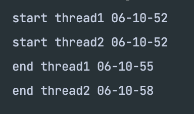

# javaLockSample
간단한 자바 락 실습입니다.

### 검증할 시나리오

스레드1이 실행되고 3초 후 쓰레드1의 실행 결과 출력

스레드2가 실행되고 3초 후 쓰레드2의 실행 결과 출력

### 실습 내용

자바의 락은 객체 단위임을 이번 테스트로 확인한다

### 결과
위처럼 쓰레드1과 쓰레드2는 순서대로 실행된다.

메소드에 락을 걸어도 자바 락은 메소드 단위가 아닌 객체 단위이다.

1. 쓰레드1이 print 메소드에 진입 쓰레드2가 진입 대기
2. 쓰레드1이 print메소드 처리 완료
3. 쓰레드2가 print메소드에 진입